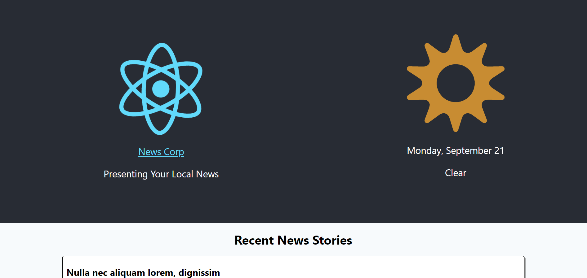

This project was bootstrapped with [Create React App](https://github.com/facebook/create-react-app).

## Project Description

This is a front end application for a local news service. Currently the application consists of a single page with the branding and a summary of recent news stories. You will need to add a widget that displays information about today's weather.

You'll need to have Node >= 8.10 and npm >= 5.6 on your machine to run the application. Once you have the project cloned, from the local-news-app directory run "npm install". You can then start the application with "npm run start".

## Requirements

- You must use git for source control.
- You must retrieve weather information from the free [Metaweather Api](https://www.metaweather.com/api/). You can retreive the user's coordinates using the browser's [Geolocation Api](https://developer.mozilla.org/en-US/docs/Web/API/Geolocation_API). If a user chooses not to provide their location, you should default to "Philadelphia".
  - Note: The Metaweather Api may return data for mulitple locations. For this assignment you can just default to the first in the list.
- You must display the weather state provided by the api (eg. "clear", "rain", etc.).
- The widget must display an appropriate icon based on the weather state. The api provides free icons for you to use.
- The widget must display today's date formatted as "Weekday, Month Day" (e.g. "Monday, September 1").
- The widget should display nicely on a mobile device.

### Suggested Design

You may use the following suggested design:

### Notes

To avoid issues with CORS for your local development you can use [CORS-Anywhere](https://cors-anywhere.herokuapp.com/) as a proxy. Just prepend the url for your api calls with "https://cors-anywhere.herokuapp.com/" (e.g. "https://cors-anywhere.herokuapp.com/https://www.metaweather.com/api/")

When creating your widget keep in mind that this widget may be used elswhere in the application in the future.

You are free to deviate from the suggested design in any way so long as it fulfills the requirements.

You are free to add any package dependencies. There are no restrictions.

Be prepared to talk about the work you did and the choices you made.

## Submitting Your Work

When you are ready to submit your work to SofterWare be sure all changes are committed to your git repository and please do one of the following:

- Zip up your git repository, host it in cloud storage (eg. Google Drive), and share a public link with your recruiter or SofterWare.
- Push your code to your own private github repository and invite the contributor(s) of this repository to be collaborators on your private github repository. DO NOT fork this repository as this would make your work visible to other prospective candidates.

## Available Scripts

In the project directory, you can run:

### `npm start`

Runs the app in the development mode. 
Open [http://localhost:3000](http://localhost:3000) to view it in the browser.

The page will reload if you make edits. 
You will also see any lint errors in the console.

### `npm test`

Launches the test runner in the interactive watch mode. 
See the section about [running tests](https://facebook.github.io/create-react-app/docs/running-tests) for more information.

### `npm run build`

Builds the app for production to the `build` folder. 
It correctly bundles React in production mode and optimizes the build for the best performance.

The build is minified and the filenames include the hashes. 
Your app is ready to be deployed!

See the section about [deployment](https://facebook.github.io/create-react-app/docs/deployment) for more information.

### `npm run eject`

**Note: this is a one-way operation. Once you `eject`, you can’t go back!**

If you aren’t satisfied with the build tool and configuration choices, you can `eject` at any time. This command will remove the single build dependency from your project.

Instead, it will copy all the configuration files and the transitive dependencies (webpack, Babel, ESLint, etc) right into your project so you have full control over them. All of the commands except `eject` will still work, but they will point to the copied scripts so you can tweak them. At this point you’re on your own.

You don’t have to ever use `eject`. The curated feature set is suitable for small and middle deployments, and you shouldn’t feel obligated to use this feature. However we understand that this tool wouldn’t be useful if you couldn’t customize it when you are ready for it.

## Learn More

You can learn more in the [Create React App documentation](https://facebook.github.io/create-react-app/docs/getting-started).

To learn React, check out the [React documentation](https://reactjs.org/).

### Code Splitting

This section has moved here: https://facebook.github.io/create-react-app/docs/code-splitting

### Analyzing the Bundle Size

This section has moved here: https://facebook.github.io/create-react-app/docs/analyzing-the-bundle-size

### Making a Progressive Web App

This section has moved here: https://facebook.github.io/create-react-app/docs/making-a-progressive-web-app

### Advanced Configuration

This section has moved here: https://facebook.github.io/create-react-app/docs/advanced-configuration

### Deployment

This section has moved here: https://facebook.github.io/create-react-app/docs/deployment

### `npm run build` fails to minify

This section has moved here: https://facebook.github.io/create-react-app/docs/troubleshooting#npm-run-build-fails-to-minify
